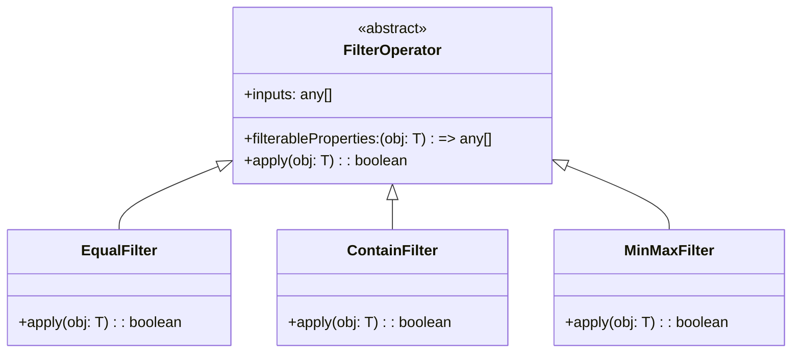

# Ngx Filter Operator Panel Library

## Overview

The `NgxFilterOperatorPanelModule` is an Angular library designed to provide a flexible and reusable filtering system for your application. This library includes various components and classes to create and manage filters, making it easier to handle complex filtering logic.

## Installation

Local library configured as an app project (cf. [`angular.json`](./../../angular.json)).


## Usage

### Importing the Module

First, import the `NgxFilterOperatorPanelModule` into your Angular module:

```
import { NgxFilterOperatorPanelModule } from 'ngx-filter-operator-panel';

@NgModule({
  imports: [
    NgxFilterOperatorPanelModule
  ]
})
export class AppModule { }
```

### Components

#### FilterBoardComponent

The `FilterBoardComponent` is the main component that contains and manages multiple filter controls.

```
<app-filter-board
  [title]="'Filter Board'"
  [filterFactory]="filterFactory"
  [filterControls]="filterControls"
  [isLoading]="isLoading">
</app-filter-board>
```

### Services

#### FilterFactory

The `FilterFactory` class manages the application of filters to a list of items.

```
const filterFactory = new FilterFactory<ItemType>(items);
filterFactory.addFilters([new EqualFilter(item => [item.property], ['value'])]);
```

## Filter Operators

### Class Diagram

Below is a class diagram illustrating the hierarchy of the current filter operators:


<details>
<summary>
See the diagram Mermaid code
</summary>



> PS: Mermaid language. Can't be rendered on Azure DevOps, so you can copy/paste code on https://mermaid.live/ to see or edit it.

</details>

### Existing operators

-   **FilterOperator**: The abstract class that defines the structure of a filter operator.
    -   **EqualFilter**: A filter operator that checks for equality. Case sensitive.
    -   **ContainFilter**: A filter operator that checks if a property contains a value. Case sensitive.
    -   **MinMaxFilter**: A filter operator that checks if a property is within a range. Greater & smaller than or equal.

> Note: It is intended to be extended if new needs arise.

## Examples

1. Here is a basic example of how to use the library in your application:

```
import { Component } from '@angular/core';
import { FilterFactory, EqualFilter, FilterControl } from 'ngx-filter-operator-panel';

@Component({
  selector: 'app-root',
  template: `
    <app-filter-board
      [title]="'Filter Board'"
      [filterFactory]="filterFactory"
      [filterControls]="filterControls">
    </app-filter-board>
  `
})
export class AppComponent {
  filterFactory = new FilterFactory<ItemType>(items);
  filterControls: FilterControl<ItemType>[] = [
    {
      title: 'Property Filter',
      filter: new EqualFilter(item => [item.property], ['value']),
      properties: new Set(['value1', 'value2'])
    }
  ];
}
```

2. And here, a more complex example of how the library can be used :

```
import { Component } from '@angular/core';
import { FilterFactory, EqualFilter, FilterControl } from 'ngx-filter-operator-panel';

@Component({
  selector: 'app-root',
  template: `
    <!-- Filters -->
    <app-filter-board
      [title]="'Filter Board'"
      [filterFactory]="filterFactory"
      [filterControls]="filterControls"
      [isLoading]="isLoading">
    </app-filter-board>

    <!-- Search bar -->
    <input type="text" [(ngModel)]="searchText" placeholder="Search an item ...">

    <!-- Items list -->
    <ul>
      <li *ngFor="let item of filteredItems$ | async">{{ item.title }}</li>
    </ul>
  `
})
export class AppComponent {
  filterFactory: FilterFactory<ItemType>;

  filterControls: FilterControl<ItemType>[] = [
    {
      title: 'Property Filter 1',
      filter: new EqualFilter<ItemType>(item => [item.propertyToFilter], ['expectedValue1', 'expectedValue2']),
      // properties: undefined (Will be loaded later)
    },
    {
      title: 'Property Filter 2',
      filter: new ContainFilter<ItemType>(item => [item.propertyToMatch, item.propertyToMatch2], [this.searchText]),
      // properties: undefined (Will be loaded later)
    },
  ];

  isLoading = true;

  searchText?: string;

  get filteredItems$(): Observable<ItemType[]> {
    return this.filterFactory.filteredItems$;
  }

  constructor(itemService: ItemService) {
    // Fetch items
    this.itemService.loadAll((items) => {

      // Create factory
      this.filterFactory = new FilterFactory<ItemType>(items);

      // Complete filters properties
      this.filterControls.forEach((control) => {
        control.properties = filterFactory.extractProperties(control.filter);
      });

      // Add filters to factory
      this.filterFactory.addFilters(this.filterControls.map(ctrl => ctrl.filter));

      // Apply filter to the factory items
      this.filterFactory.applyFilters();

      this.isLoading = false;
    });
  }
}
```

## Configuration

You can configure the module with synchronous or asynchronous translations for the filter operator messages.

### Synchronous Configuration

```
@NgModule({
  imports: [
    NgxFilterOperatorPanelModule.forRoot({
      reset: 'Reset',
      apply: 'Apply',
      all: 'All',
      unavailableFilter: 'No filter available.'
    })
  ]
})
export class AppModule { }
```

### Asynchronous Configuration

```
import { TranslateService } from '@ngx-translate/core';

@NgModule({
  imports: [NgxFilterOperatorPanelModule],
  providers: [
    {
      provide: 'FILTER_OPERATOR_TRANSLATIONS',
      useFactory: (translateService: TranslateService) => ({
        reset:              translateService.get('Reset'),
        apply:              translateService.get('Apply'),
        all:                translateService.get('All'),
        unavailableFilter:  translateService.get('No filter available.'),
      } as Partial<IFilterOperatorMessages>),
      deps: [TranslateService],
    },
  ]
})
export class AppModule { }
```